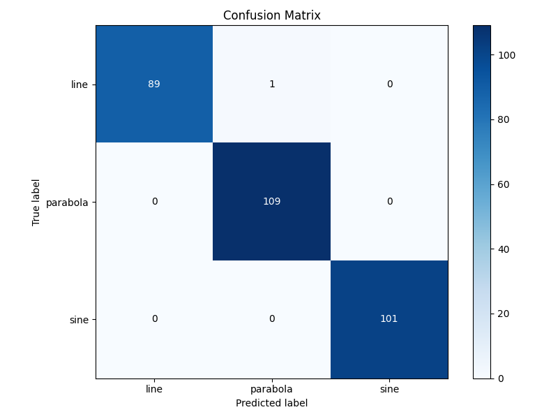
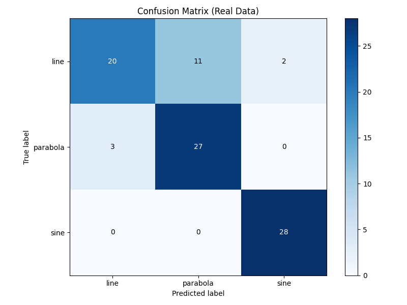

# Cargo

A deep learning project exploring whether synthetic data can effectively replace scarce real data for image classification. Given only a limited set of real images of geometric shapes (lines, parabolas, sine waves), this project builds synthetic data simulators that generate realistic training samples, trains a MobileNetV3-Small model entirely on synthetic data, and evaluates how well the learned representations transfer to real images. The pipeline includes domain-gap bridging through targeted augmentations, per-class confidence threshold calibration on the small real dataset, and systematic evaluation to validate assumptions about synthetic-to-real transfer.

## Setup

```bash
pip install -r requirements.txt
```

## Data Preparation

### Real Data (required)

Real images must be manually placed before training:

```
data/real_data/
  line/
  parabola/
  sine/
```

Each folder should contain `.png` images of the corresponding shape class. Real data is used for threshold calibration and real-world evaluation. Training will exit with an error if any class folder is empty or missing.

### Synthetic Data (auto-generated)

Synthetic data is generated automatically when training starts if any class folder under `data/synthetic/` is empty. Each class generates 1000 images (576x576) containing scattered dot trails along the geometric shape, with random outlier dots and obstacle shapes to simulate real-world conditions.

To regenerate manually:

```bash
python scripts/generate_synthetic_lines.py
python scripts/generate_synthetic_parabolas.py
python scripts/generate_synthetic_sines.py
```

## Training

```bash
python main.py --config configs/default.yaml
```

The training pipeline runs the following steps in order:

1. Validates that real data exists for all classes
2. Generates synthetic data if missing
3. Trains the model on synthetic data
4. Evaluates on the synthetic test set
5. Calibrates per-class confidence thresholds on real data

Training configuration (see `configs/default.yaml`):

## Inference

```bash
python scripts/run_inference.py --image <path_to_image>
```

Arguments (all optional with defaults):

- `--config` — config file (default: `configs/default.yaml`)
- `--model` — model weights (default: `outputs/model.pt`)
- `--thresholds` — thresholds JSON (default: `outputs/thresholds.json`)
- `--image` — image to classify (default: `data/real_data/line/line_00000.png`)

The classifier applies per-class confidence thresholds and returns `UNKNOWN` if no class exceeds its threshold.

## Outputs

After training, the following artifacts are saved to `outputs/`:

- `model.pt` — trained model state dict
- `thresholds.json` — per-class confidence thresholds (calibrated on real data)
- `checkpoints/` — PyTorch Lightning checkpoints (best val_loss)
- `syn_test_results.txt` / `real_test_results.txt` — classification reports
- `syn_confusion_matrix.png` / `real_confusion_matrix.png` — confusion matrix plots

## Technical Report

### 1. Algorithm Overview

The pipeline follows a train-on-synthetic, calibrate-on-real approach:

1. **Synthetic data generation** — For each class (line, parabola, sine), 1000 images are generated with scattered dot trails along the geometric curve, plus random outlier dots and obstacle shapes. This provides abundant labeled training data without manual annotation.
2. **Transfer learning** — A MobileNetV3-Small backbone pretrained on ImageNet is fine-tuned. The original classifier head is replaced with a custom head, Only 5 epochs are needed due to strong pretrained features.
3. **Domain gap bridging** — Training augmentations (ColorJitter, GaussianBlur, random flip/rotation) reduce the visual gap between synthetic data (sharp black dots on white background) and real data (softer edges, varying contrast).
4. **Evaluation** — The model is evaluated on a held-out synthetic test set (10% split) to verify learning.
5. **Threshold calibration** — Per-class confidence thresholds are computed on real data by finding the threshold that maximizes the F1 score on each class's precision-recall curve (one-vs-all). This provides a reject option for uncertain predictions.

### 2. Algorithm Performance

**Synthetic test set** (300 images):

| Class    | Precision | Recall | F1-Score |
|----------|-----------|--------|----------|
| Line     | 1.00      | 0.99   | 0.99     |
| Parabola | 0.99      | 1.00   | 1.00     |
| Sine     | 1.00      | 1.00   | 1.00     |
| **Overall accuracy** | | | **1.00** |

**Real data evaluation** (91 images):

| Class    | Precision | Recall | F1-Score |
|----------|-----------|--------|----------|
| Line     | 0.87      | 0.61   | 0.71     |
| Parabola | 0.71      | 0.90   | 0.79     |
| Sine     | 0.93      | 1.00   | 0.97     |
| **Overall accuracy** | | | **0.82** |

The confusion matrices below demonstrate strong performance on both synthetic and real data, with minimal domain gap:

**Synthetic data confusion matrix:**



**Real data confusion matrix:**



The main confusion is between line and parabola (11 line images misclassified as parabola), which is expected since parabolas with low curvature visually resemble lines.

**Why these metrics matter:**
- **Precision** — measures false positive rate per class; important when misclassification has a cost.
- **Recall** — measures missed detections; critical for the line class where many are missed (0.61).
- **F1-Score** — harmonic mean balancing both; used to calibrate per-class thresholds.

**Inference timing:** MobileNetV3-Small was chosen specifically for efficiency. Single-image inference (including image loading, preprocessing, and forward pass) takes approximately 70ms on average on a typical laptop CPU, well under the 250ms target. The `classify_image` function times each call and prints the result.

### 3. Implementation Details

**Implemented components:**
- PyTorch Lightning training loop with ModelCheckpoint and EarlyStopping callbacks
- Synthetic data generators producing realistic dot-trail patterns for all 3 shape classes
- Domain-gap augmentation pipeline (ColorJitter, GaussianBlur) targeting known synthetic-to-real differences
- Per-class threshold calibration using precision-recall curves on real data
- Threshold-aware inference with `ShapeClass` enum including an `UNKNOWN` class for rejected predictions
- Automatic data validation and synthetic regeneration at startup

**Not implemented (due to time/data constraints):**
- Additional training augmentations  would improve robustness to real-world image variations.
- Improved synthetic data generation for line vs. parabola — generating more parabolas with very low curvature and more lines with slight curves near the decision boundary would teach the model to better discriminate between these two classes, directly addressing the main source of confusion in the real data evaluation
- Larger real data collection — only ~30 images per class for calibration; more real samples would produce more reliable thresholds

### 4. Motivations & Alternatives

**Why MobileNetV3-Small:**
MobileNetV3-Small provides an strong balance of accuracy and speed. Its inverted residual blocks with squeeze-and-excitation attention extract discriminative features efficiently, and the small model size (~2.5M parameters) ensures inference stays well under the 250ms CPU target. ImageNet pretraining provides general visual features that transfer well to dot-trail pattern recognition, requiring only a few epochs of fine-tuning.

**Why train on synthetic, calibrate on real:**
Synthetic data can be generated in unlimited quantities with perfect labels, solving the labeled data scarcity problem. However, the distribution shift between synthetic and real data means raw model outputs are not well-calibrated for real-world use. Calibrating thresholds on a small real dataset bridges this gap without requiring large amounts of labeled real data.

**Alternative 1: Classical computer vision (Hough transform + curve fitting)**
Detect dots via blob detection, then fit lines/parabolas/sines using RANSAC or least-squares. This would be fully interpretable and require no training data. However, it is brittle to noise, outlier dots, and obstacle shapes, and would require manual tuning of detection parameters for each data condition.

**Alternative 2: Training directly on real data with heavy augmentation**
Skip synthetic data entirely and train on augmented real images. This avoids the domain gap problem but requires significantly more labeled real data (currently only ~30 images per class) and risks overfitting on a small dataset.

The synthetic + calibration approach was chosen because it maximizes use of available data: unlimited synthetic for learning features, small real set for calibration.

### 5. Future Improvements

- **Improved synthetic data for line/parabola discrimination** — analyze the misclassified line images to understand what visual patterns cause them to be predicted as parabolas (e.g., dot noise creating a slight curve, or short line segments that are ambiguous). Use these insights to improve the synthetic generators: generate lines with controlled noise patterns that mimic the confusing cases, and generate parabolas with varying curvature levels including near-linear ones, so the model learns the subtle boundary between the two classes
- **More real data** — increasing the calibration set beyond ~30 images per class would produce more reliable thresholds, especially for the line/parabola boundary
- **Hard example mining** — identify and generate more synthetic examples near the line/parabola decision boundary to improve discrimination
